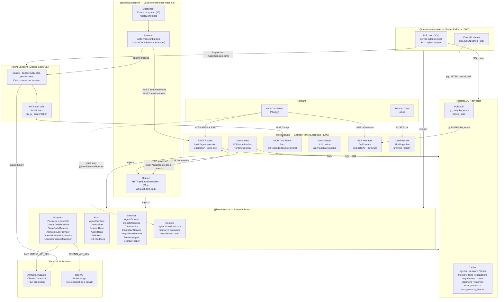
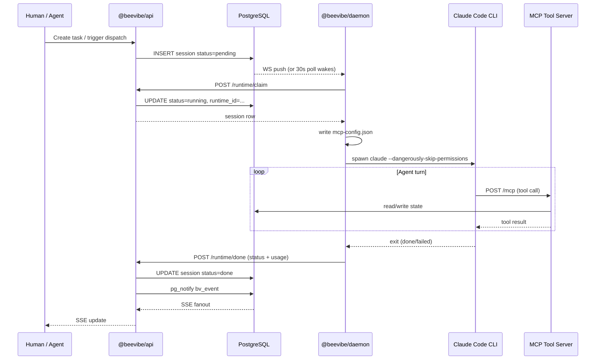
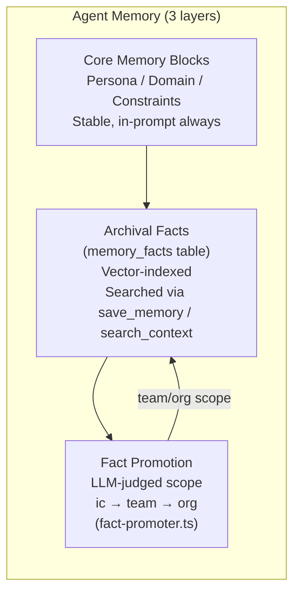
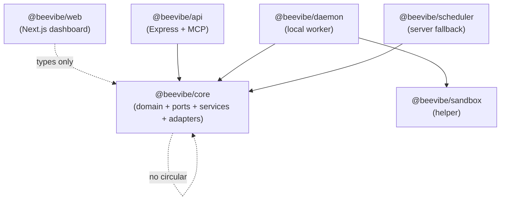

# Beevibe Architecture

## System Overview

Beevibe is an agent-orchestration platform built as a TypeScript monorepo. It manages the full lifecycle of AI agent sessions: provisioning, dispatching, executing, and coordinating multi-agent workflows.

## Component Diagram

## Session Lifecycle

## Memory Architecture

## MCP Tool Tiers

| Tier | Tools Available | Count |
|------|----------------|-------|
| **IC (Individual Contributor)** | save_memory, update_core_memory, search_context, update_progress, find_up, get_agent_profile, get_task, create_work_product, list_work_products, get_work_product, respond_ask, report_blocker | 12 |
| **Team** | All IC tools + find_subordinates, find_peers, create_task, create_subordinate_agent, check_work_status, revise_task, ask, negotiate, respond_negotiate, escalate_to_humans, add_to_escalation | 23 |
| **Org** | All Team tools | 23 |

## Package Dependency Graph

## Key Design Decisions

| Decision | Choice | Rationale |
|----------|--------|-----------|
| Session execution | Local daemon (claude CLI) | Agents run on user machines with full filesystem/tool access |
| Server fallback | In-process scheduler | Handles mesh asks when target daemon is offline |
| Pub/sub | Postgres pg_notify | No external broker required; SSE fanout via single LISTEN |
| Memory | pgvector + archival + core blocks | Stable blocks always in-prompt; facts recalled by semantic search |
| Inter-agent coordination | MeshServer in-process | ask/negotiate without external queue |
| Orphan recovery | Heartbeat + PID check | Detects crashed sessions, re-dispatches with --resume |
| Tool gating | hierarchy_level (ic/team/org) | Finer-grained capability control without separate auth layers |
